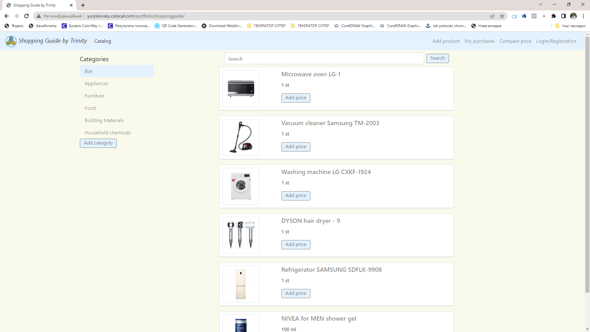
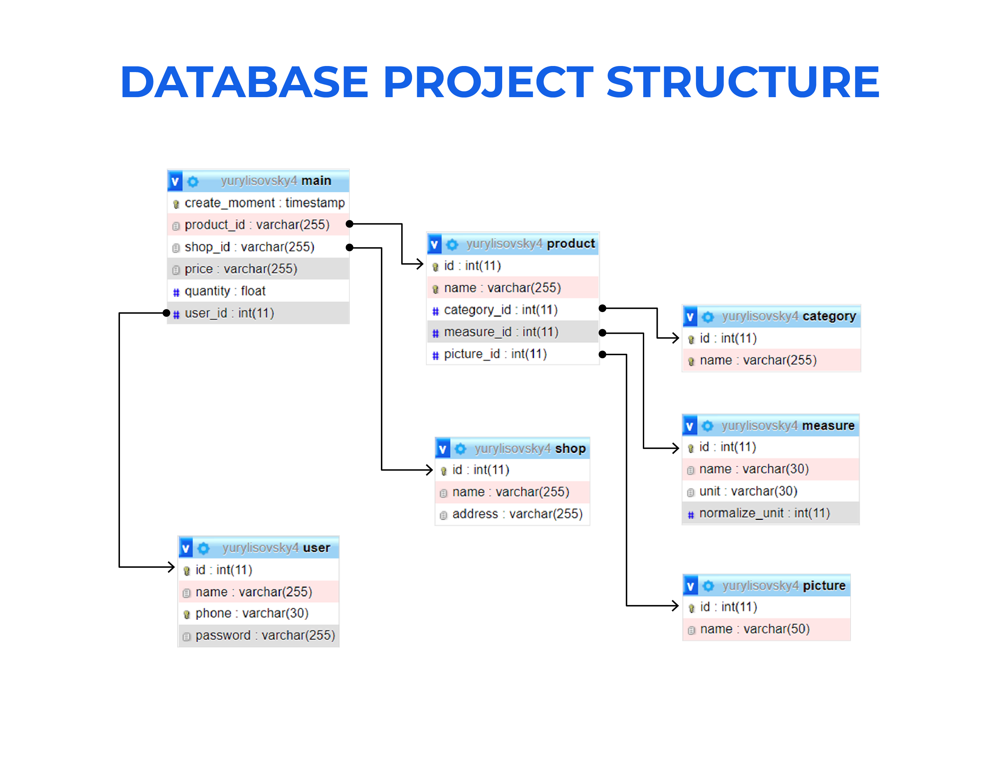
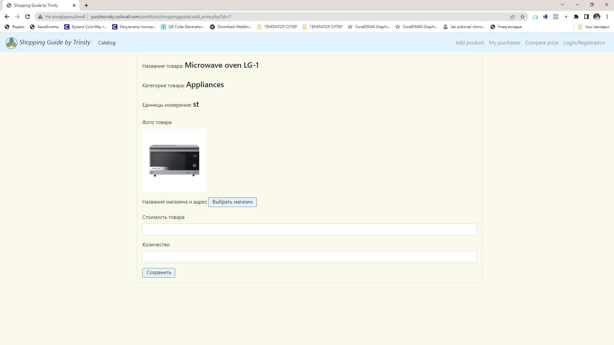
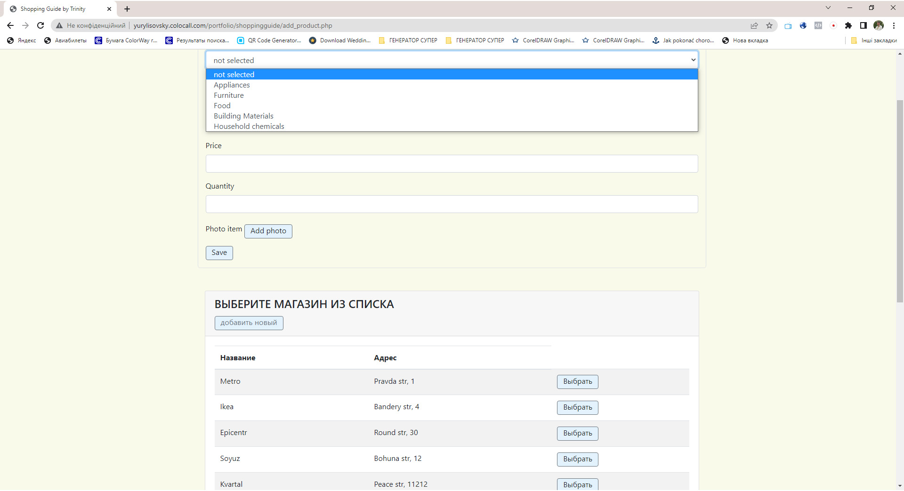
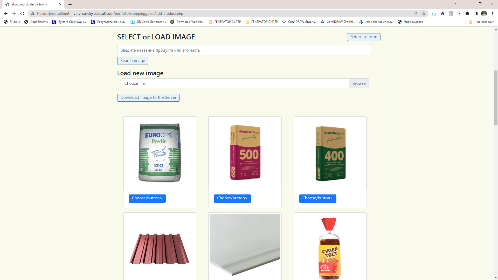

<h1 align="center">Study Project ShoppingGuide</h1>

<!--  -->

<h2 align="center"><a  href="http://yurylisovsky.colocall.com/portfolio/shoppingguide/">Go to project</a></h2>

## Description

The idea of ​​the project was born from life. How to save money when buying? It is often necessary to compare the prices of goods or products in different stores. Sellers and manufacturers deliberately do so to confuse the buyer and sell him the product at an inflated price. Make different volumes and more. The project aims to store information about the price and volume or weight of the product in different stores. This allows you to check where a kilogram, piece, cubic meter or other unit of measurement is cheaper.
<!-- Ідея проекту народилася з життя. Як зекономити при покупці? Дуже часто треба порівнювати ціни на товари чи продукти в різних магазинах. Продавці та виробники свідомо роблять так, щоб заплутати покупця і продати йому продукт по завищеній ціні. Роблять різні об'єми та іншє. Проект спрямований на зберіганні інформації про ціну та об'єм чи вагу продукту в різних магазинах. Це дозволяє перевірити де кілограм, штука, метр кубічний чи інша одиниця виміру коштує дешевше. -->

## About the project.

This project is part of a training of skills in the course of study. In it I passed the following stages: development of the idea of ​​the project, designing of a database, partial development of a frontend part, programming of a backend part. It is interesting to pay attention to the query to the database to find the best price for a given product.
<!-- Цей проект є частиною тренування навичок в курсі навчання. В ньому я проходив наступні етапи: розробка ідеї проекту, проектування бази даних, часткова розробка фронтенд частини, програмування бекенд частини. Цікаво звернути увагу на запит до бази даних для пошуку по заданому товару найвигіднішого за ціною. -->

	$sql="SELECT product.name, main.price, measure.unit, main.quantity, shop.name AS shop_name, measure.name AS measure_name, shop.address, picture.name AS picture_name, (1 / main.quantity * main.price / measure.normalize_unit) AS normalize_price FROM main inner join product on main.product_id = product.id inner join picture on product.picture_id = picture.id inner join measure on product.measure_id = measure.id inner join shop on main.shop_id = shop.id WHERE product.name LIKE '%" . $_GET["text"] . "%' ORDER BY normalize_price ASC";  

### The structure of the database has been developed

### The project is based on Ajax queries and data processing in JSON format

### Implemented uploading user images to the site	

## This project used:

HTML, CSS, JavaScript, Ajax, JSON, Sql

## Another similar project

<h2 align="center"><a  href="https://github.com/yurlis/gardenhelper">Go to project on GitHub</a></h2>
